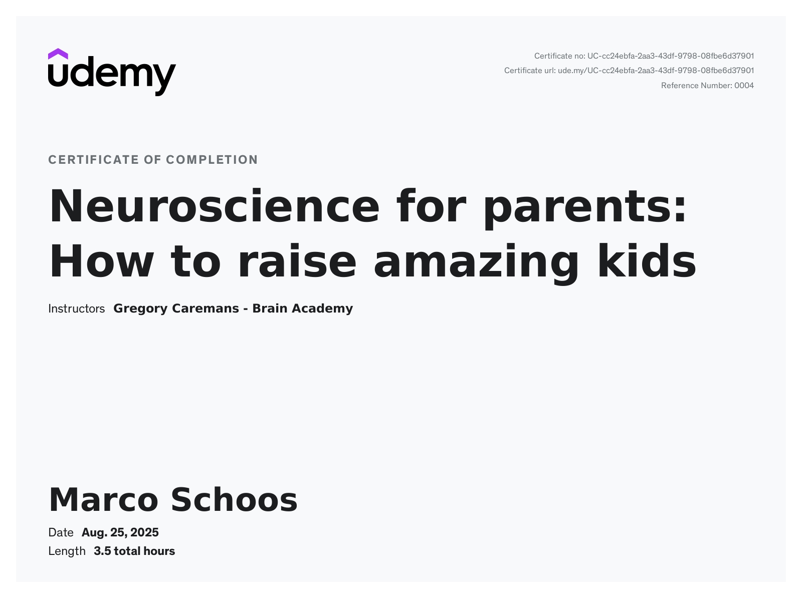

# Udemy - Neuroscience for parents: How to raise amazing kids - Gregory Caremans

In this folder you can find my notes from the udemy course [Neuroscience for parents: How to raise amazing kids](https://www.udemy.com/course/neuroscience-and-parenting) from Gregory Caremans.

## Review

⭐ 4.5/5 – A Clear, Science-Backed Guide to Parenting

This is an outstanding and highly informative course that is exceptionally easy to follow. The presenter speaks very clearly and is extremely easy to understand. I particularly appreciated the strong reliance on scientific research, which gives the advice credibility and a solid foundation.

The presentation style is engaging, though on a personal note, I would have preferred slightly more on-screen text to make note-taking easier. This is, however, a minor personal preference and doesn't detract from the overall high quality of the delivery.

My only other slight critique is that I sometimes wished for a bit more practical nuance. While the scientific studies are invaluable, it would be beneficial to acknowledge more explicitly that every child is unique and that not every method will be a perfect fit for every family. A little more guidance on adapting these principles to different personalities would make the course even more comprehensive.

Overall, this is a fantastic course that provides parents with a powerful framework for understanding their child's development. Highly recommended for any parent looking to ground their approach in science.

## Structure

In the *notes* folder you can find my notes from Remnote as Remnote file, markdown or html export.

## Remarks

I did not create flashcards for Remnote in this course as I don't think this would be really useful.

## Course certificate

