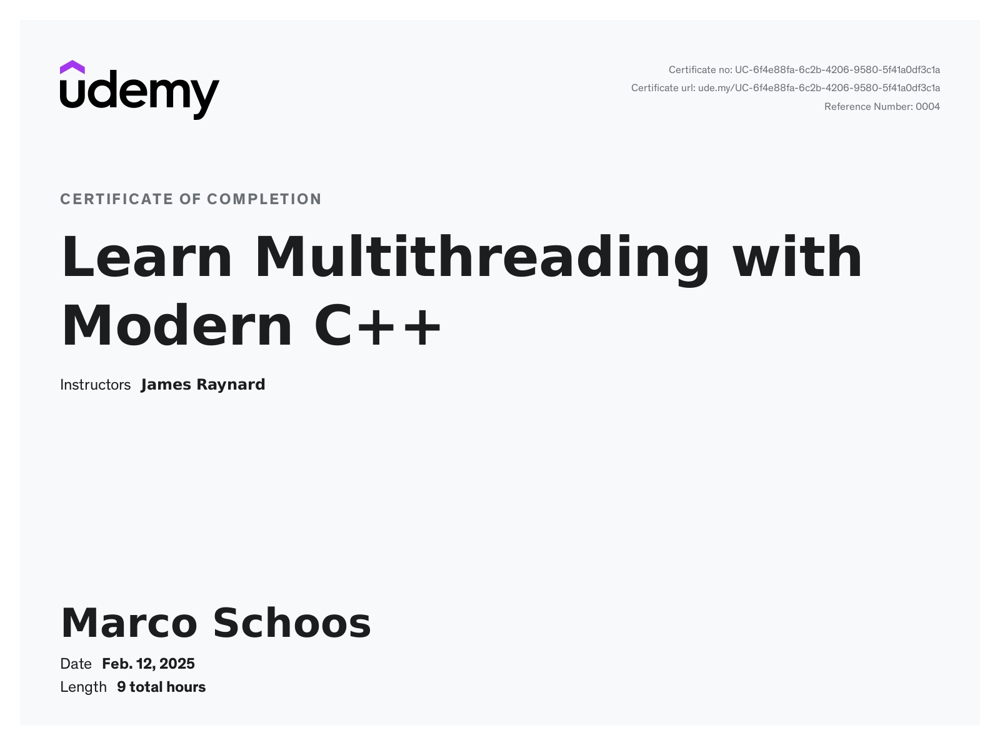

# Udemy Course - Learn Multithreading with Modern C++

In this folder you can find my notes and code from the Udemy course [Learn Multithreading with Modern C++](https://www.udemy.com/course/learn-modern-cplusplus-concurrency/).

## Review

⭐ 5/5 – Comprehensive & Engaging

This course is an excellent deep dive into C++ Concurrency, delivered by an instructor who is both highly knowledgeable and genuinely enthusiastic about the subject. His clear explanations and well-paced demos make complex multithreading concepts accessible, even for intermediate learners. The content is well-structured, covering everything from basic thread management to advanced synchronization techniques, making it a valuable resource for developers looking to master concurrent programming in C++.

Highly recommended!

## Structure

In the *notes* folder you can find my notes from Remnote as Remnote file, markdown or html export. The *code* folder contains some code which was shown in the course as well as the exercises, sometimes with small adjustements from me.

## Build the code

You can build the code all in one by running this commands in the code folder. But you can also run the same commands in each subfolder if only a part of the code shall be build.

```sh
mkdir build
cd build
cmake ..
cmake --build .
```

## Remarks

At the end of chapter three are some lectures about computer architecture. As they are not to relevant here and are also covered by other courses I attended, I did not add notes of it.

The instructor updated the course, s.t. my implementation of thread pool starting at lecture 85 differs a bit from the current videos.

The notes are also not that deeply structured, since I moved them from OneNote to Remnote a few weeks after I finished the course.

## Practical Project

I extended the thread pool and concurrent queue shown in this course and implemented a small [task scheduler](https://github.com/codingwithmagga/task_scheduler) with some examples.

## Course certificate

