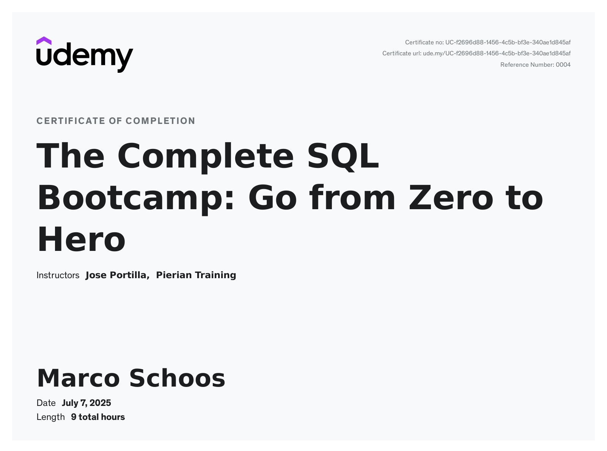

# Udemy Course - The Complete SQL Bootcamp: Go from Zero to Hero by Jose Portilla

In this folder you can find my notes and code from the Udemy course [The Complete SQL Bootcamp: Go from Zero to Hero](https://www.udemy.com/course/the-complete-sql-bootcamp).

## Review

⭐ 4.5/5

The SQL Bootcamp on Udemy is a very well-structured course. The animations and graphics are clear and easy to understand, making even more complex concepts approachable. The instructor speaks clearly, and everything is explained in a way that's easy to follow. I particularly liked the challenges—they are smoothly integrated and provide helpful practice.

A few minor points for improvement: some sections repeat information unnecessarily. With the challenges, it's easy to accidentally see the solutions; splitting the hints and solutions into separate videos would help. The challenges also get a bit too easy and become less frequent toward the end. The final assessment could use a bit more care and depth.

Overall, it's a great introduction to SQL with lots of well-presented content, but there’s room for improvement regarding the challenge structure. Highly recommended for beginners!

## Structure

In the *notes* folder you can find my notes from Remnote as Remnote file, markdown or html export (TODO). The *code* folder contains the exercises and my solutions to the tests and challenges from the course. In general these are the SQL commands which can be executed for example in pgAdmin.

## Remarks

Currently no remarks.

## Course certificate

