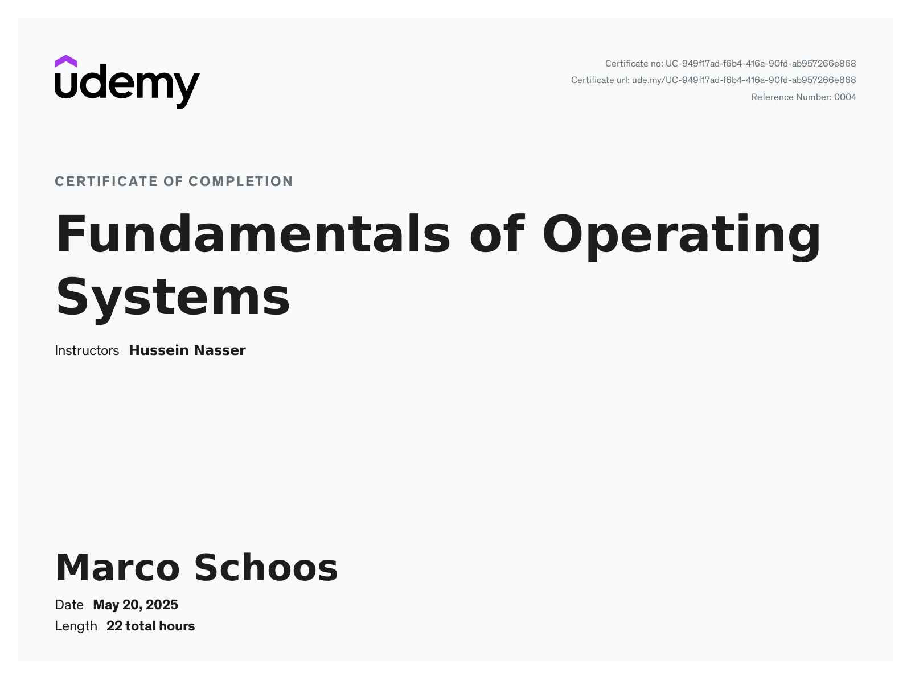

# Udemy Course - Fundamentals of Operating System by Hussein Nasser

In this folder you can find my notes and code from the Udemy course [Fundamentals of Operating Systems](https://www.udemy.com/course/fundamentals-of-operating-systems).

## Review

⭐ 4.5/5 – Excellent Content, Minor Presentation Flaws

This course is a deep dive into operating systems, taught by an instructor who is clearly passionate and knowledgeable about the subject. His enthusiasm makes the material engaging, and he does a great job explaining complex concepts with clear examples and analogies. The course covers a wide range of OS fundamentals, from process scheduling to memory management, making it a valuable resource for students and professionals alike.

However, there are a few minor drawbacks:
* Occasional tangents: The instructor’s deep expertise sometimes leads to detours, which can disrupt the flow.
* Slides are sparse: They don’t always capture the full depth of his explanations, requiring supplemental note-taking or external research (Google, ChatGPT, etc.).
*  Some forward-referencing: Concepts are occasionally introduced prematurely, which might confuse beginners.

Despite these issues, the content quality is outstanding, and the instructor’s passion makes up for the structural quirks. If you’re willing to actively engage and fill in minor gaps, this course is well worth the time.

Final Verdict: Highly recommended for those who want a thorough understanding of OS concepts, but be prepared to supplement with additional notes or resources.

## Structure

In the *notes* folder you can find my notes from Remnote as Remnote file, markdown or html export. The *code* folder contains some code which was shown in the course, sometimes with small adjustements from me.

## Build the code

```sh
cd code
mkdir build
cd build
cmake ..
cmake --build .
```

## Remarks

There are no Notes from the first section "Before we start" and the last one "Bonus section" since it wouldn't make too much sense. Almost everything which is noted here can be found elsewhere in the course. I have also just copied the notes from the second section "Why an OS?" from OneNote since most of it will also be covered in more detail later in the course and I just started using Remnote later.

Some notes are enriched with information from Google or ChatGPT, as stated in the Review section.

Note that I added code in the file `code/31_demo_process_management/main.c` to get it run under Windows. The original code is only for linux. The webserver example in `code/44_socket_management_demo` also only runs under linux, but I did not add code for windows here.

## Course certificate

