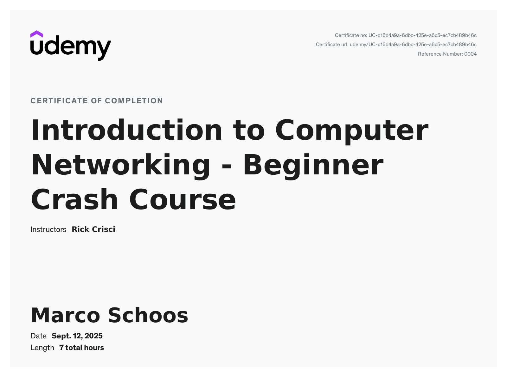

# Udemy Course - Introduction to Computer Networking - Beginner Crash Course by Rick Crisci

In this folder you can find my notes and code from the Udemy course [Introduction to Computer Networking - Beginner Crash Course](https://www.udemy.com/course/networkingbasics/).

## Review

⭐ 3.5/5 – Solid Foundation, But Uneven Execution

This course provides a generally good introduction to networking basics. The instructor speaks clearly, and the pace of the videos is nice, making the content easy to understand and follow along with. The inclusion of quizzes helps reinforce the learning, and they are well-designed for the most part.

A major positive is the availability of supplementary information material, which is helpful for review. However, the quality of these materials is inconsistent; they often feel AI-generated, are sometimes too lengthy, contain information not covered in the videos, or are occasionally missing altogether.

The main drawback is the uneven quality and structure. While some videos are excellent and very well-explained, others feel rushed, as if they were quickly assembled from AI-sourced information. Some topics are covered too briefly, and explanations sometimes focus on a specific example rather than providing general, foundational knowledge. The course structure could be improved, as the order of videos isn't always logical—some concepts introduced late would be more helpful if presented earlier. There is also some redundancy, particularly in the final sections.

Overall, this course offers a decent foundation for beginners but requires more polish in its delivery and structure to be truly outstanding.

## Structure

In the *notes* folder you can find my notes from Remnote as Remnote file, markdown or html export.

## Course certificate

