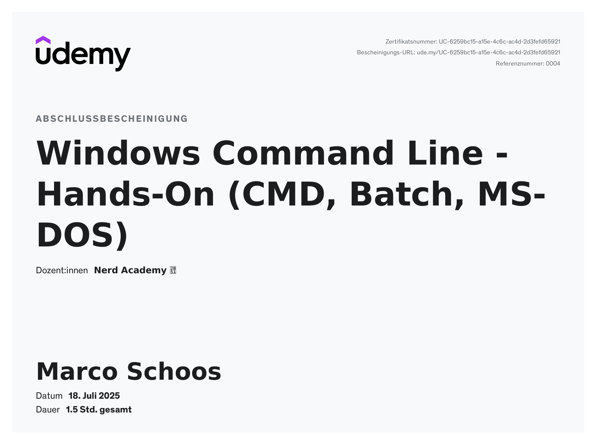

# Udemy Course - Windows Command Line - Hands-On (CMD, Batch, MS-DOS) by Nerd Academy

In this folder you can find my notes and code from the Udemy course [Windows Command Line - Hands-On (CMD, Batch, MS-DOS)](https://www.udemy.com/course/the-complete-windows-command-line-course).

## Review

⭐ 3/5 – Decent Introduction to the Windows Command Line, But Could Be Improved

This course provides a solid foundation for learning the Windows Command Line, with clear explanations and a practical, hands-on approach. The instructor’s live demonstrations ("Live Programming") make it easier to follow along, and the quizzes are well-structured and thorough, helping reinforce the material.

However, there are some drawbacks. The background music is distracting and often too loud, and the animations feel unnecessary at times. The repetitive intros and outros (e.g., "What we are going to learn," "Summary") become tedious, especially since most videos are only around 5 minutes long. Additionally, there are grammatical errors in the slides, and some explanations feel rushed—commands are sometimes demonstrated without showing their actual output, leaving learners guessing.

Overall, it’s a good course for beginners, but the presentation and pacing could be refined for a smoother learning experience.

## Structure

In the *notes* folder you can find my notes from Remnote as Remnote file, markdown or html export. 

## Course certificate

