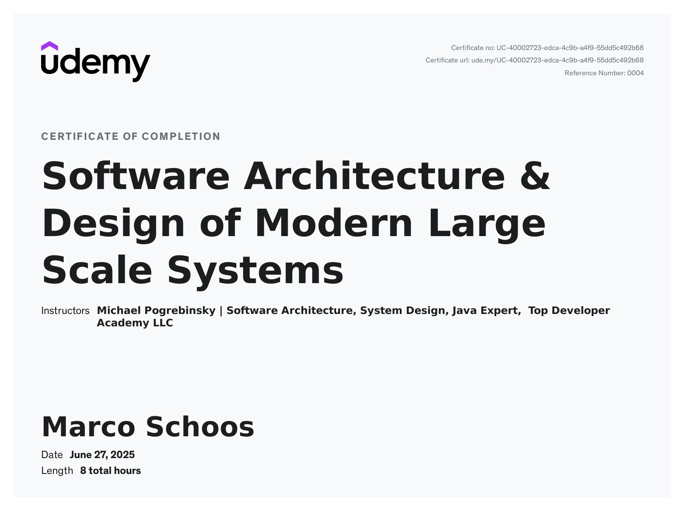

# Udemy Course - Udemy Kurs Software Architecture & Design of Modern Large Scale Systems

In this folder you can find my notes and code from the Udemy course [Udemy Kurs Software Architecture & Design of Modern Large Scale Systems](https://www.udemy.com/course/software-architecture-design-of-modern-large-scale-systems).

## Review

⭐ 5/5

This course provides excellent examples that help illustrate complex concepts in software architecture and large-scale system design. The quiz questions are well-thought-out and helpful, reinforcing the material effectively.

One minor drawback is the very slow speaking pace of the instructor - I recommend increasing the playback speed for a better learning experience. That said, the audio quality is excellent, making the content easy to follow.

While there are no live coding examples, this is understandable given the theoretical nature of the topic.

Overall, this is a highly recommended course for anyone looking to deepen their understanding of modern software architecture.

## Structure

In the *notes* folder you can find my notes from Remnote as Remnote file, markdown or html export.

## Course certificate

