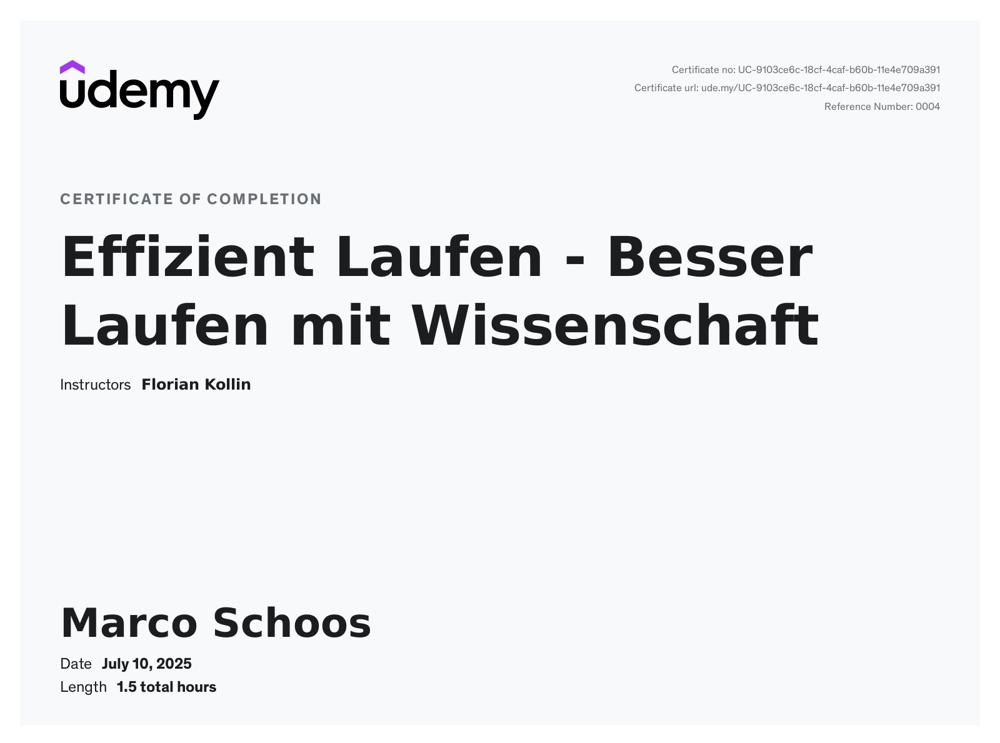

# Udemy Course - Effizient Laufen - Besser Laufen mit Wissenschaft - Florian Kollin

In this folder you can find my notes from the Udemy course [Effizient Laufen - Besser Laufen mit Wissenschaft](https://www.udemy.com/course/effizient-laufen-besser-laufen-mit-wissenschaft/) from Florian Kollin.

## Review

⭐4/5 - Great course with a scientific approach, but could use a bit more depth and polish

This course is really nice—the instructor comes across as friendly and sympathetic, and the explanations are easy to understand. I especially liked the scientific perspective on running, which makes the content feel well-founded and credible.  

However, the quizzes felt a bit unnecessary and didn’t add much value. Some slides could have included more detailed information, as they sometimes felt too brief. A few explanations were a little too short, leaving me wanting a bit more depth. Additionally, there were moments where slides were displayed that didn’t quite match what was being discussed, which was a bit distracting.  

Overall, a solid and informative course, but with some small improvements, it could be even better!

## Structure

In the *notes* folder you can find my notes from Remnote as Remnote file, markdown or html export.

## Remarks

The course is in German, and so are my notes, but you can easily translate them using tools like DeepL or ChatGPT.

To reinforce my understanding, I created Remnote flashcards to revisit these points regularly, although I wouldn’t describe this as a structured learning process.

## Course certificate

